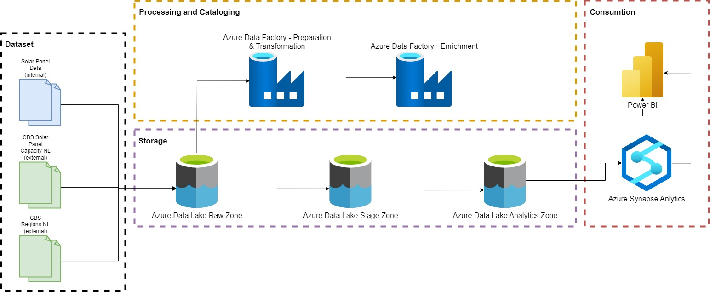

# Solar Energy Analytics
## Steps

#### AZURE BLOB STORAGE:
###### General configuration RAW ZONE
    - name -> YOUR RAW ZONE BLOB STORAGE
    - type -> storage account
    - kind -> storage v2
    - resource group -> YOUR RESOURCE GROUP
    - container -> solar-energy-analytics

###### General configuration STAGE ZONE
    - name -> YOUR STAGE ZONE BLOB STORAGE
    - type -> storage account
    - kind -> storage v2
    - resource group -> YOUR RESOURCE GROUP
    - container -> solar-energy-analytics

###### General configuration ANALYTICS ZONE
    - name -> YOUR ANALYTICS ZONE BLOB STORAGE
    - type -> storage account
    - kind -> storage v2
    - resource group -> YOUR RESOURCE GROUP
    - container -> solar-energy-analytics

## Architecture-Diagram
